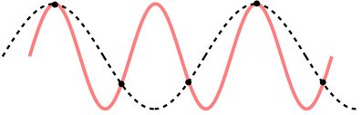

Esame di didattica dell'informatica, A.A. 2024/2025

Dal suono ai numeri: un viaggio unplugged nel digitale

Fabio Viggiano - 0001195183

# Changelog

In seguito alle indicazioni ricevute sulla prima stesura consegnata a fine maggio, la relazione è stata profondamente revisionata per migliorarne la chiarezza, la coerenza didattica e l'aderenza ai requisiti richiesti. Le principali modifiche apportate sono le seguenti:

* Riformulazione degli obiettivi:

Gli "Obiettivi generali sono stati riscritti in un'ottica student-centered ("Lo studente sarà in grado di..."), rendendoli più chiari e misurabili, come richiesto.
 Sono stati integrati espliciti riferimenti ai traguardi dei documenti ministeriali, in particolare alle "Proposte di indicazioni nazionali del CINI" e alle "Nuove indicazioni 2025", indicando i codici specifici degli obiettivi toccati dall'unità didattica.
* Semplificazione e coerenza con l'età:
È stata rimossa la terminologia tecnica non adatta alla scuola secondaria di I grado (es. "sinusoide, onda quadra") dalla fase di disegno iniziale, sostituendola con un linguaggio più intuitivo e metaforico ("onde morbide come colline", "punte affilate come montagne").
* Potenziamento delle strategie di differenziazione:
La sezione sulla differenziazione didattica è stata completamente riscritta e ampliata. Ora fornisce strategie concrete e dettagliate sia per lo scaffolding (studenti con difficoltà/BES) sia per il potenziamento (studenti ad alto potenziale cognitivo), con suggerimenti specifici per ogni fase della lezione.
* Miglioramento della struttura e della chiarezza espositiva:
La struttura del documento è stata razionalizzata, eliminando sezioni ambigue e riorganizzando i contenuti in modo più logico (es. posizionamento della "Contestualizzazione storica").
Il tono generale è stato reso più formale e meno colloquiale, distinguendo più nettamente tra la "guida per l'insegnante" e le azioni dello "studente".
Le sezioni "Grandi Idee" e "Prerequisiti" sono state affinate per essere più pertinenti e concise.

# Inquadramento del lavoro

## Livello di scuola, classe/i, indirizzo

L'unità didattica è rivolta a studenti e studentesse di età compresa tra gli 11 e i 13/14 anni (scuola secondaria di I grado).

L'informatica, disciplina prevalente dell'unità, si integra in modo interdisciplinare con la tecnologia (i processi di trasformazione), la matematica (in particolare grafici cartesiani e approssimazione), le scienze (attraverso lo studio delle onde sonore) e la musica (considerando la natura del suono).

L'obiettivo è far apprendere agli studenti il concetto di suono digitale, insieme ai processi di campionamento e quantizzazione che ne permettono la rappresentazione e l'elaborazione mediante strumenti informatici. Questo verrà illustrato facendo disegnare loro un'onda sonora su carta millimetrata. Vediamo come questa unità didattica può inoltre essere adattata a studenti di età inferiore e superiore:

Scuola primaria (classi 4-5): semplificando la terminologia, usando griglie più grandi come il classico foglio del quaderno a quadretti e meno livelli di quantizzazione, l'uso di matite colorate, concentrandosi sull'idea di "fare foto" (campionare) e "arrotondare" (quantizzare) un disegno.

Obiettivo: introdurre il concetto di “trasformare suoni in numeri” in modo intuitivo.

Adattamento:

- utilizzo di una linea del tempo con disegni al posto del grafico, ad esempio disegnando l’intensità del suono con l’altezza di barrette colorate
- introduzione del concetto di “fotografare” il suono in momenti precisi (campionamento) con esempi come scattare tante foto in sequenza

Scuola secondaria di II grado (primo biennio): introducendo concetti più formali come frequenza di campionamento (Hz), bit depth, teorema di Nyquist (in modo intuitivo), e discutendo maggiormente il compromesso tra la qualità e la dimensione file.

Obiettivo: collegare l'attività a concetti più formali di informatica, matematica e fisica.

Adattamento:

- aggiunta di una seconda parte in cui si mostra come il segnale può essere rappresentato come array numerici (es. su fogli di calcolo)
- introduzione dei concetti di frequenza di campionamento, bit depth, aliasing
- se disponibile, utilizzo di strumenti digitali per confrontare grafici manuali con versioni digitali

## Motivazione e finalità

La presente attività si inserisce all’interno del percorso di educazione scientifica e tecnologica della scuola secondaria di I grado, con l’obiettivo di introdurre concetti fondamentali dell’informatica in modo intuitivo e concreto. In particolare, si affronta il tema della digitalizzazione del suono, un argomento di grande attualità e rilevanza, spesso trascurato nei programmi scolastici.

L'idea nasce da due grandi passioni, ossia la tecnologia e la musica; questi due percorsi si sono spesso intrecciati nel mio percorso e, nell'ipotizzare un argomento di lezione, ho pensato alle basi del suono digitale, uno dei primi passi di qualsiasi musicista o fruitore dell'ascolto della musica in digitale quando la curiosità lo porta a interrogarsi su cosa si cela dietro il tasto play di un riproduttore di suoni.

L’attività è progettata per essere unplugged, ovvero priva di strumenti tecnologici complessi, al fine di stimolare la comprensione profonda dei concetti attraverso la manipolazione diretta e la simulazione analogica dei processi di campionamento e quantizzazione.

Nelle prime battute l'idea era a un bivio tra un approccio ancora più interattivo attraverso l'uso di campionamenti e quantizzazioni differenti da provare in aula ed un approccio attraverso lo sviluppo di codice; in entrambi i casi si sono però intraviste criticità, in primis sull'andare contro i principi dell'attività unplugged. Tali sviluppi sono dunque da rimandare verso un percorso più ampio e più specifico negli studi musicali.

## Innovatività

Sebbene le attività unplugged per l'informatica siano diffuse, questa proposta si focalizza specificamente sulla visualizzazione manuale e combinata del campionamento e della quantizzazione su carta millimetrata come processo sequenziale applicato a un segnale disegnato dagli studenti stessi. L'approccio manuale rende più chiari i passaggi e l'approssimazione necessaria, cosa che le simulazioni software fanno meno.

Esistono risorse online e attività unplugged generiche sulla rappresentazione binaria, come CS Unplugged sulla rappresentazione delle immagini, ma meno focalizzate sul processo A/D audio in questo modo specifico. Questa unità:

- mantiene: l'approccio unplugged e l'uso di metafore concrete
- differenzia/migliora: integra campionamento e quantizzazione in un unico flusso di lavoro manuale, partendo da un "segnale" creato dallo studente, rendendo il processo più personale e tangibile. Enfatizza la visualizzazione della perdita di informazione confrontando il disegno originale con quello "digitalizzato".

L'innovatività della lezione in questione è quindi presente come lo studente creatore del segnale, quindi protagonista del processo. La digitalizzazione avviene fisicamente, passo-passo, su carta, rendendo visibile e modificabile ogni singolo passo della conversione A/D; a ciò si aggiunge la riproduzione del suono rendendo la lezione, se possibile, anche interattiva.

## Prerequisiti

- comprensione di base di un grafico cartesiano (asse x = tempo, asse y = ampiezza/valore)
- capacità di leggere valori su un asse graduato
- concetto intuitivo di "segnale che cambia nel tempo" (es. volume della musica, altezza di una collina)
- concetto di approssimazione (arrotondamento a un valore vicino)

### Percorso

Questa attività può essere considerata autoconsistente per introdurre i concetti base, può però far parte di un percorso più ampio sull'introduzione al suono come onda sonora (scienze/musica).

Questa unità didattica può definirsi come: "campionamento e quantizzazione unplugged". Ad essa, si possono collegare in incontri successivi dei passaggi come:

- introduzione alla rappresentazione binaria dei numeri (collegare i livelli di quantizzazione ai bit)
- utilizzo di software semplice di editing audio (es. Audacity) per visualizzare forme d'onda reali e gli effetti di cambi di frequenza di campionamento/bit depth (collegamento al concreto)
- discussione sulla compressione audio come passo successivo

### Contestualizzazione storica

L’attività didattica si inserisce nell’ambito dell’educazione al pensiero computazionale e alla comprensione dei fondamenti del digitale, in particolare del processo di digitalizzazione del suono. Questo processo è governato da due principi fondamentali: il campionamento e la quantizzazione. Il teorema di Nyquist-Shannon stabilisce che per rappresentare fedelmente un segnale analogico, è necessario campionarlo ad una frequenza almeno doppia rispetto alla massima frequenza presente nel segnale. Se questa condizione non è rispettata, si verifica il fenomeno dell’aliasing, ovvero la comparsa di distorsioni nel segnale digitale.

La quantizzazione, invece, consiste nell’approssimare ogni campione a un valore discreto all’interno di un numero finito di livelli, determinati dalla profondità in bit. Questo introduce un errore chiamato rumore di quantizzazione, che può ridurre la qualità del segnale audio risultante. In termini didattici, questi concetti rappresentano un’occasione per esplorare in modo interdisciplinare nozioni di matematica (discretizzazione, numeri binari) e di fisica (onde sonore), rendendoli tangibili attraverso attività concrete e visive.

Questi principi, benché astratti, possono essere veicolati efficacemente anche a studenti della scuola secondaria di primo grado tramite attività unplugged, come la rappresentazione su carta millimetrata, e con esempi uditivi selezionati. Tuttavia, come evidenziato nella riflessione critica, è essenziale che la progettazione didattica tenga conto delle limitazioni percettive e cognitive degli studenti, affinché la traduzione pratica dei concetti teorici risulti significativa e accessibile.

### Obiettivo generale

Accompagnare gli studenti della scuola secondaria di primo grado alla scoperta del mondo digitale attraverso attività unplugged legate al suono, favorendo la comprensione dei concetti di campionamento, quantizzazione, e rappresentazione numerica del suono.

## Contenuti (spiegati a un informatico)

Conversione analogico-digitale (ADC)

Campionamento: discretizzazione dell'asse temporale. Acquisizione del valore del segnale a intervalli regolari T (periodo di campionamento). Frequenza di campionamento fs = 1/T. (Si introduce solo l'idea intuitiva che campionare più spesso cattura meglio le variazioni rapide).

Quantizzazione: discretizzazione dell'asse delle ampiezze. Approssimazione del valore campionato al livello più vicino tra un insieme finito di livelli discreti (quantizzazione scalare uniforme). Il numero di livelli è legato alla risoluzione (bit depth). (Si introduce solo l'idea di "arrotondare" a valori predefiniti).

Errore di quantizzazione: differenza tra l'ampiezza esatta del campione e il valore digitale assegnato dalla quantizzazione. È l'inevitabile scarto dovuto all'approssimazione a livelli finiti.

Rappresentazione digitale come sequenza di numeri: il segnale audio, dopo campionamento e quantizzazione, diventa una successione di valori numerici. Ogni numero codifica l'ampiezza di un campione in un preciso istante.

## Grandi idee

Rappresentazione dei dati: come l'informazione continua del mondo reale (suono) viene rappresentata in forma discreta (numeri) comprensibile a un computer.

Astrazione: il processo di campionamento e quantizzazione è un'astrazione che semplifica la complessità del segnale reale, perdendo dettagli ma rendendolo manipolabile.

## Traguardi e obiettivi

### Traguardi generali dai documenti ministeriali/proposte

L’attività si inserisce in un quadro nazionale e risponde a precise richieste istituzionali.

#### Proposta di indicazioni nazionali per l'insegnamento dell’informatica nella scuola

Secondo il documento del CINI, i traguardi raggiunti per lo sviluppo delle competenze al termine di questa unità didattica saranno:

- **M-1**: l’allievo comprende l’esigenza di precisione affinché le istruzioni vengano interpretate sempre nello stesso modo da un esecutore automatico
- **T-M-2**: descrive in maniera algoritmica semplici processi della natura o della vita quotidiana o studiati in altre discipline
- **T-M-3**: comprende l'importanza e la necessità di riflettere sulla correttezza delle descrizioni algoritmiche
- **T-M-7**: riconosce dati di ingresso e di uscita delle applicazioni informatiche
- **T-M-9**: classifica le tipologie di dati (es.: numerici, testuali, ...)
- **T-M-10**: conosce l'architettura di principio (fisica e funzionale) di un sistema di elaborazione digitale
- **T-M-11**: riconosce le componenti hardware e software dei sistemi di elaborazione digitale
- **T-M-14**: seleziona ed utilizza, anche in modo combinato, programmi e servizi software per raggiungere uno specifico obiettivo
- **T-M-15**: sperimenta le potenzialità della tecnologia informatica come strumento di espressione personale
- **O-M-D-2**: effettua operazioni semplici su simboli che rappresentano informazione strutturata (es. numeri binari, immagini "bitmap")

#### Nuove indicazioni 2025 - scuola dell’infanzia e primo ciclo di istruzione

Secondo il testo reperibile sul sito del Ministero dell’Istruzione che definisce le linee di indirizzo dei nuovi curricoli per le scuole dell’infanzia, nell’ambito degli obiettivi specifici di apprendimento, al termine dell’unità didattica, gli allievi:
- (**Numeri**) saper fornire stime approssimate per il risultato di un’operazione e controllare la plausibilità di un calcolo
- (**Spazio e figure**) rappresentare punti, segmenti e figure nel piano cartesiano
- (**Spazio e figure**) descrivere figure complesse e costruzioni geometriche al fine di comunicarle ad altri
- (**Spazio e figure**) riprodurre figure e disegni geometrici in base a una descrizione e codificazione fatta da altri
- (**Dati e previsioni**) rappresentare insiemi di dati, anche facendo uso di software
- (**Informatica**) esprimere gli algoritmi in funzione delle capacità dell’esecutore e riflettere sulla loro correttezza

### Traguardi/obiettivi generali

Al termine di questa unità, lo studente sarà in grado di:
- spiegare con parole proprie il concetto di **campionamento** di un segnale audio, descrivendo come un'onda sonora continua viene convertita in una serie di valori discreti
- descrivere il significato di **quantizzazione** e motivare perché questo processo introduce una inevitabile perdita di informazione rispetto al segnale originale
- mettere in relazione un'onda sonora (fenomeno fisico) con la sua **rappresentazione digitale** (sequenza di numeri), spiegando i passaggi fondamentali della conversione
- applicare i principi del **pensiero computazionale** (in particolare la discretizzazione) per descrivere come un fenomeno continuo può essere gestito da un computer
- analizzare la relazione tra parametri come la **frequenza di campionamento** e la **qualità del suono digitale**, formulando ipotesi su come questi influenzino la fedeltà della riproduzione

### Obiettivi specifici in forma operativa

#### Livello 1: ricordare (**remembering**)
- Lo studente/la studentessa è in grado di definire i concetti di "**campionamento**", "**frequenza di campionamento**" e "**quantizzazione**" nel contesto dell'audio digitale
- Lo studente/la studentessa è in grado di elencare in sequenza le fasi principali del processo di conversione di un segnale audio da analogico a digitale
- Lo studente/la studentessa è in grado di identificare le componenti **hardware** (es. microfono, scheda audio) e **software** (es. editor audio) necessarie per acquisire un suono con un computer

#### Livello 2: comprendere (**understanding**)
- Lo studente/la studentessa è in grado di spiegare con parole proprie perché un computer necessita di **discretizzare** un segnale continuo come un'onda sonora
- Lo studente/la studentessa è in grado di descrivere perché il processo di **quantizzazione** comporta una perdita irreversibile di informazioni rispetto al segnale originale
- Lo studente/la studentessa è in grado di riassumere la relazione tra un'onda sonora (fenomeno fisico) e la sua **rappresentazione digitale** (sequenza di numeri binari)
- Lo studente/la studentessa è in grado di confrontare il concetto di **segnale analogico** (continuo) con quello di **segnale digitale** (discreto), utilizzando l'audio come esempio

#### Livello 3: applicare (**applying**)
- Lo studente/la studentessa è in grado di utilizzare un **software di editing audio** (es. Audacity) per registrare un breve suono e visualizzarne la forma d'onda
- Lo studente/la studentessa è in grado di modificare i **parametri** di un file audio (es. frequenza di campionamento, profondità di bit) per osservarne l'effetto sulla **dimensione del file**
- Lo studente/la studentessa è in grado di calcolare la **dimensione** (in bit o byte) di un breve file audio non compresso, dati la frequenza di campionamento, la profondità di bit e la durata

#### Livello 4: analizzare (**analyzing**)
- Lo studente/la studentessa è in grado di analizzare la **forma d'onda** di un segnale audio digitale, distinguendo l'effetto di una **bassa frequenza di campionamento** da quello di una **bassa profondità di bit**
- Lo studente/la studentessa è in grado di confrontare due registrazioni audio dello stesso suono, realizzate con **parametri di qualità diversi**, e collegare le differenze qualitative percepite (**chiarezza**, **rumore

#### Livello 4: Analizzare (**Analyzing**)
- Lo studente/la studentessa è in grado di analizzare la **forma d'onda** di un segnale audio digitale, distinguendo l'effetto di una **bassa frequenza di campionamento** da quello di una **bassa profondità di bit**.
- Lo studente/la studentessa è in grado di confrontare due registrazioni audio dello stesso suono, realizzate con **parametri di qualità diversi**, e collegare le differenze qualitative percepite (**chiarezza**, **rumore di fondo**) ai parametri tecnici utilizzati.
- Lo studente/la studentessa è in grado di scomporre il processo di **digitalizzazione audio** in un diagramma che illustri i **dati di ingresso** (onda sonora) e i **dati di uscita** (sequenza di numeri).

#### Livello 5-6: Valutare e Creare (**Evaluating and Creating**)
- Lo studente/la studentessa è in grado di formulare un'**ipotesi verificabile** sulla relazione tra l'aumento della **frequenza di campionamento** e il miglioramento della **fedeltà di riproduzione** di un suono.
- Lo studente/la studentessa è in grado di giustificare la scelta di specifici **parametri di codifica audio** (es. qualità CD vs. qualità telefonica) in base a un determinato scopo di utilizzo (es. podcast, suoneria, archiviazione musicale).
- Lo studente/la studentessa è in grado di **progettare un semplice esperimento**, utilizzando un software audio, per dimostrare l'impatto della **quantizzazione** sulla qualità del suono.

## Metodologie didattiche

- **(Unplugged Activity)**: Attività svolta senza l'uso di computer, utilizzando materiali concreti (carta, matita) per simulare processi computazionali. Permette di focalizzarsi sui concetti senza la barriera tecnologica.

- **(Apprendimento Attivo / Learning by Doing)**: Gli studenti non sono recettori passivi, ma eseguono attivamente i passaggi di campionamento e quantizzazione.

- **(Visualizzazione)**: L'uso della carta millimetrata e del disegno è centrale per rendere visibili concetti astratti.

- **(Lezione Dialogata)**: L'insegnante guida l'attività, ma stimola la discussione, pone domande e incoraggia la riflessione collettiva.

## Tempi

Totale: Circa 2 ore (es. 2 moduli da 50-60 minuti).

## Spazi

- Aula scolastica standard con banchi adatti per disegnare.

- Lavagna o LIM per le spiegazioni e dimostrazioni dell'insegnante.

## Materiali e Strumenti

- Fogli di carta millimetrata (almeno 2-3 per studente/coppia).

- Matite con punta media (HB o simile).

- Gomme per cancellare.

- Matite colorate o pennarelli a punta fine (almeno 2 colori diversi per studente o eventuale coppia, es. nero e rosso).

- Righello (opzionale, può aiutare a tracciare i livelli di quantizzazione).

- Lavagna/LIM/tablet e pennarelli/pennino.

# Sviluppo dei contenuti

## Fase 1 - Introduzione e l'onda analogica (15-20 min)

### Guida insegnante

#### La domanda del docente - Come arriva la musica

Aprire la lezione ponendo una domanda aperta agli studenti:

> "Come pensate che la musica che ascoltate arrivi sui vostri cellulari o computer?"

**Scopo:** Raccogliere le loro idee iniziali, stimolare la discussione e creare un collegamento con la loro esperienza quotidiana. Lasciare che emergano diverse ipotesi per poi disegnare sulla lavagna un'onda sonora illustrando brevemente di cosa si tratta.

### Guida studente

#### La risposta alla domanda - La musica da dove arriva

Alla domanda del docente, lo studente è invitato a rispondere, generalmente l’ età media in aula è quella in cui si approccia alla musica in modo indipendente iniziando a scoprire artisti e generi più affini. Il punto di contatto con il quotidiano potrà portare a risposte fantasiose, il riferimento ad artisti più o  meno attuali, chi è più estroverso magari a voler far ascoltare qualcosa che sta sentendo in quel periodo.

> “Da Internet!” / “Dalle casse del cellulare!” / “Dalle registrazioni in studio dei Metallica!”

#### La richiesta del disegno

### Guida insegnante

Chiedere agli studenti di disegnare la propria onda sonora personale, con una frase come:

> "Adesso, sulla carta millimetrata, disegniamo il viaggio di un suono. Immaginate che la linea orizzontale in basso sia il tempo che passa, mentre la linea verticale a sinistra sia il volume: più la linea che disegnate è in alto, più il suono è forte. Create il vostro suono! Potete disegnare una linea con onde morbide e tonde, come delle colline, oppure con punte affilate, come le cime di una montagna. Potete anche disegnare una linea che fa dei salti netti verso l'alto e verso il basso, come dei gradini. Siate creativi, è il vostro suono personale!"

Nel mentre della richiesta sarebbe bene disegnare su un supporto visibile agli studenti gli esempi delle diverse onde sonore per agevolare chi ha più difficoltà nel disegno.

### Guida studente

##### Preparazione e ricezione delle istruzioni

Lo studente riceve il materiale: Prende possesso del foglio di carta millimetrata e degli strumenti da disegno (matita, pennarelli).
Lo studente ascolta e decodifica la consegna: Ascolta l'insegnante mentre spiega il significato dei due assi sul foglio:

Asse orizzontale (X): Lo associa al concetto di "tempo che passa".
Asse verticale (Y): Lo associa al concetto di "volume" o "intensità del suono" (alto = forte; basso = debole/silenzio).

##### Osservazione e interiorizzazione degli esempi

Lo studente osserva attivamente: Guarda l'insegnante mentre disegna alla lavagna (o su un supporto visibile) gli esempi di onde sonore.
Lo studente associa le forme ai suoni: Collega mentalmente le diverse rappresentazioni grafiche ai tipi di suono corrispondenti:
Onde morbide e arrotondate: Le associa a suoni dolci, continui e graduali
Punte acute e affilate: Le associa a suoni improvvisi, forti e brevi 
Linee a gradoni (segmenti orizzontali e verticali netti): Le associa a suoni artificiali, on/off o intermittenti.

##### Ideazione e progettazione personale

Lo studente attiva l'immaginazione: Pensa e sceglie un suono specifico da rappresentare. Questo può essere un suono reale (la pioggia, il miagolio di un gatto), un suono immaginario, o una sequenza di suoni che raccontano una piccola storia (es. una tempesta che arriva, esplode e si allontana).
Lo studente pianifica la traduzione grafica: Prefigura mentalmente come le caratteristiche del suono scelto (inizio, durata, picchi di volume, cali, fine) possano essere trasformate in una linea sul foglio.

## Fase 2 - Campionamento - Fare le "fotografie" (20-25 min)

### Guida insegnante

#### Campionare il suono

Illustrare agli studenti il concetto di fotografia del suono, con una descrizione come.

>  "Il computer non può 'vedere' tutta la curva contemporaneamente. Deve guardarla un pezzetto alla volta, a intervalli regolari. È come fare delle foto (o misurare l'altezza) dell'onda ogni secondo, o ogni mezzo secondo. Questo si chiama campionamento e la velocità con cui facciamo le 'fotografie' al nostro suono è la frequenza di campionamento”

Decidere insieme una "frequenza di campionamento" visiva. Suggerimento: "Proviamo a misurare la nostra onda ogni 3 quadretti sull'asse del tempo." (Scegliere un intervallo che generi un numero ragionevole di campioni, es. 8-15 punti).

Dimostrare alla lavagna/LIM: sull'onda disegnata, segnare un punto esattamente sulla curva in corrispondenza di x=0, x=3, x=6, x=9, ecc.

### Guida studente 

#### Campionare il proprio suono

Lo studente ascolta e interiorizza l'analogia: Ascolta l'insegnante spiegare che un computer, a differenza dell'occhio umano, non può percepire la totalità della curva sonora in un solo istante. Lo studente interiorizza l'idea del computer che "fa delle foto" o "misura l'altezza" della curva a intervalli regolari.

Lo studente associa il termine tecnico all'azione pratica: Collega il termine astratto "campionamento" all'azione concreta di "misurare a pezzetti". Capisce che la "frequenza di campionamento" non è altro che la regola che decide quanto spesso fare queste misurazioni (es. "ogni secondo", "ogni tre passi").
Lo studente si appropria del metodo: Prende il proprio disegno, la matita (o un pennarello di un altro colore per evidenziare) e, se necessario, un righello.
Lo studente esegue il campionamento: Applica sistematicamente la regola condivisa al proprio "suono personale".
Individua il punto di partenza (tempo = 0) e segna un punto evidente sulla sua linea.
Conta 3 quadretti verso destra lungo l'asse orizzontale.
Da quel punto, sale verticalmente fino a incrociare la linea del suo suono.
In quel punto esatto di intersezione, disegna un altro punto ben marcato.
Ripete questo processo metodicamente per tutta la lunghezza del suo disegno (a 6, 9, 12 quadretti, ecc.).
Lo studente confronta l'originale con il risultato: Al termine dell'operazione, osserva il suo foglio. Ora non vede più solo una linea, ma una linea continua (il suono "reale", analogico) e una serie di campioni (i punti, ovvero i dati "digitali") che ne descrivono l'andamento.

Lo studente percepisce l'approssimazione: Guardando solo i punti che ha disegnato, si rende conto che, anche senza la linea originale a collegarli, essi mantengono l'informazione essenziale sulla forma del suono. Può ancora "vedere" dove il suono era forte (punti in alto) e dove era debole (punti in basso), dove saliva e dove scende

Lo studente giunge a un'intuizione fondamentale: Capisce che il computer non memorizza tutto il suono, ma solo questa serie di "fotografie" (i campioni). Più queste foto sono vicine (cioè più alta è la frequenza di campionamento), più l'immagine ricostruita sarà fedele all'originale. Ha appena visualizzato il principio alla base della digitalizzazione del suono.

## Fase 3 - Quantizzazione - Arrotondare l'altezza (20-25 min)

### Guida insegnante

Illustrare agli studenti il concetto di quantizzazione attraverso l’ arrotondamento dei valori, ciò che va fatto è introdurre l'idea che il computer non può gestire un numero infinito di altezze possibili. Ha bisogno di "categorie" o "livelli" predefiniti. La quantizzazione è il processo di "arrotondare" l'altezza reale di ogni campione al livello permesso più vicino.

Una frase potrebbe essere:

> “I nostri punti campionati possono avere qualsiasi altezza. Il computer, invece, funziona a 'gradini'. Dobbiamo associare ogni punto al gradino più vicino. Questo processo si chiama quantizzazione. "

Ciò che va fatto è rendere visibili i livelli di quantizzazione, sulla carta millimetrata, evidenziare (magari con un tratto leggero di un altro colore o ripassando la linea) le linee orizzontali corrispondenti a valori Y interi (..., -2, -1, 0, 1, 2, 3, ...). Oppure, se la curva è tutta positiva, solo 0, 1, 2, 3... Assegnare un numero (il valore Y) a ciascuna linea evidenziata. 

> “Questi sono i nostri livelli consentiti.”

Dimostrare alla lavagna/LIM: Prendere un punto di campionamento. Guardare la sua altezza Y. Trovare la linea orizzontale (livello consentito) più vicina a quel punto. Segnare un nuovo punto (es. una crocetta) che ha la stessa X del campione originale, ma la cui Y è esattamente sul livello consentito più vicino. Ripetere per alcuni campioni.

Girare tra i banchi aiutando a trovare il livello più vicino. Questo è il passaggio concettualmente più 
delicato.

Istruzione aggiuntiva da fornire agli allievi: 

> "Ora, per ogni crocetta che avete fatto, scrivete sotto (o a fianco) il numero del livello su cui si trova. Fatelo in ordine, da sinistra a destra. Questa sequenza di numeri è il nostro 'segnale digitale'!"

*Discussione guidata*: "L'altezza delle crocette è esattamente uguale a quella dei puntini originali? (No, è approssimata). Cosa succederebbe se avessimo meno livelli consentiti, ad esempio solo le linee 0, 2, 4...? (L'approssimazione sarebbe più 'grossolana', perderemmo più dettagli sull'altezza). E se avessimo più livelli, ad esempio anche le linee intermedie a metà quadretto? (L'approssimazione sarebbe più precisa)." Introdurre l'idea intuitiva che più livelli = più fedeltà nell'ampiezza.

### Guida studente

Lo studente esegue l'arrotondamento visivo.

Per ogni punto campione che ha disegnato prima, ora compie un'operazione di giudizio:
- Fissa un punto.
- Guarda in alto e in basso, verso le linee evidenziate più vicine.
- Decide quale delle due linee è la più prossima.
- Disegna una crocetta sulla stessa linea verticale del punto originale, ma posizionandola esattamente sul "livello consentito" che ha scelto.
- Ripete questo processo per tutti i suoi campioni, sentendosi un po' come se stesse "correggendo" il suo disegno per adattarlo a una regola.
- Lo studente traduce il grafico in un codice.
- Osserva le sue crocette. Per ognuna di esse, legge il numero corrispondente al livello (il valore Y) su cui si trova e lo scrive in sequenza su un lato del foglio. 

Il risultato è il disegno dal quale vedrà la sua curva sonora trasformarsi in una semplice lista di numeri. Capisce che quella è l'informazione che il computer memorizzerà.
Lo studente percepisce la perdita di informazione.

Confronta la posizione dei punti originali con quella delle crocette. Nota immediatamente che non coincidono quasi mai. C'è sempre una piccola differenza, un piccolo "errore". Si rende conto che, per rendere il suono comprensibile al computer, ha dovuto sacrificare un po' di precisione. L'altezza delle crocette è solo un'approssimazione.
Lo studente giunge a un'intuizione fondamentale sulla qualità.

Attraverso le domande dell'insegnante, immagina due scenari. Se i "livelli" fossero stati più distanti (es. solo le linee 0, 2, 4...), le sue crocette sarebbero state ancora più lontane dai punti originali, e l'approssimazione molto più grossolana. Se, invece, i livelli fossero stati più fitti, le crocette sarebbero state quasi identiche ai punti originali. Capisce così il secondo principio della digitalizzazione: il numero di "gradini" (livelli di quantizzazione) determina la fedeltà dell'ampiezza del suono. Più livelli ci sono, più il suono digitale assomiglia a quello reale.

## Fase 4 - Ricostruzione e confronto (15-20 min)

Obiettivo: Far comprendere agli studenti come un dispositivo digitale (es. un computer, un telefono) utilizza la sequenza numerica per ricreare un segnale udibile. Questa fase permette di visualizzare la differenza tra il segnale analogico originale e quello digitale ricostruito, consolidando i concetti di approssimazione e perdita di informazione.

### Guida insegnante

#### Introdurre il problema inverso

Lanciare la sfida finale agli studenti:

"Bene, ora abbiamo la nostra lista di numeri, il nostro 'segnale digitale'. Questo è ciò che viene salvato in un file MP3. Ma come facciamo a riascoltarlo? Il computer deve fare il processo inverso: prendere questi numeri e ritrasformarli in un'onda. Oggi saremo noi a fare il lavoro delle casse del vostro telefono!"

Scopo: Impostare il compito come un'inversione del processo precedente, introducendo l'idea della conversione da digitale ad analogico (DAC).

#### Guidare la Ricostruzione

Fornire istruzioni chiare e dimostrare il primo passaggio alla lavagna:
"Prendete un pennarello di un nuovo colore. Ora, dimenticatevi della vostra curva originale e delle crocette. Guardate solo la sequenza di numeri che avete scritto.
Leggete il primo numero della lista.
Trovate la prima posizione di campionamento (a x=3, per esempio) e l'altezza corrispondente a quel numero. Segnate un punto.
Fate lo stesso per il secondo numero.
Adesso, collegate questi due punti con una linea retta.
Continuate così: leggete un numero, trovate il punto e collegatelo a quello precedente. Stiamo 'unendo i puntini'."
Nota per l'insegnante: È cruciale che gli studenti lavorino solo sulla base della loro sequenza numerica per simulare il comportamento di una macchina che non ha accesso all'informazione originale.

#### Stimolare il Confronto e la Discussione Finale

Una volta che tutti hanno terminato, guidare una discussione di sintesi:
"Ora osservate il vostro foglio. Vedete tre cose: la vostra onda originale morbida, le crocette e questa nuova linea spezzata.
La linea che avete appena disegnato è uguale all'originale?
Che forma ha? Cosa vi ricorda?
Cosa ci dice questo sulla musica che ascoltiamo? È una copia perfetta o un'approssimazione incredibilmente buona?"
Scopo: Portare gli studenti a una conclusione consapevole. L'audio digitale è una ricostruzione basata su dati discreti, e la sua qualità dipende dalla "densità" di quei dati (frequenza di campionamento e livelli di quantizzazione).

### Guida studente

Lo studente accetta la sfida finale: tornare indietro
Lo studente ascolta l'insegnante e capisce che il lavoro non è finito. Se prima ha "smontato" il suono in numeri, ora deve "rimontarlo". Interiorizza l'idea che questo è ciò che accade ogni volta che preme "play" su una canzone.
Lo studente si mette nei panni del computer
Prende un pennarello di un altro colore, pronto a eseguire un compito puramente meccanico. Si sforza di ignorare la sua bellissima curva originale e di concentrarsi solo sulla fredda sequenza di numeri che ha scritto. Applica l'algoritmo passo dopo passo:
Legge il primo numero (es. "2").
Si posiziona sulla prima coordinata temporale (x=3) e sale fino al livello "2", disegnando un punto.
Legge il secondo numero (es. "4").
Si sposta sulla seconda coordinata temporale (x=6) e sale al livello "4", disegnando un altro punto.
Con il righello o a mano libera, traccia un segmento che unisce i due punti.
Ripete metodicamente il processo, sentendosi come una stampante che esegue un comando, fino a esaurire la lista di numeri.
Lo studente osserva il risultato: l'onda "digitale"
Al termine, guarda il suo foglio. Vede emergere una nuova forma: non è la sua onda morbida originale, ma una linea spezzata, fatta di segmenti retti, spigolosa e geometrica. Assomiglia a una catena montuosa stilizzata o al profilo di un edificio.
Lo studente confronta i tre mondi e giunge a una comprensione completa
Con un solo sguardo, ora può vedere l'intero processo:
L'originale (mondo analogico): La sua curva fluida, l'idea perfetta del suono.
I dati (mondo digitale): Le crocette e la sequenza di numeri, ovvero l'informazione salvata, discreta e approssimata.
La ricostruzione (il ritorno al mondo analogico): La linea spezzata, che rappresenta il suono come può essere ricreato da una macchina.
Capisce visivamente perché l'audio digitale non è "reale", ma una ricostruzione. Intuisce che se i suoi campioni fossero stati più fitti e i suoi "gradini" (livelli) più numerosi, la linea spezzata sarebbe stata molto più vicina alla sua curva originale, quasi indistinguibile. Ha appena visualizzato il compromesso tra la qualità di un file audio e la quantità di dati necessari per descriverlo.

## Fase 5 -  Variare i parametri e conclusioni (20-30 min)

### Guida insegnante

Obiettivo: Consolidare l'apprendimento spingendo gli studenti a riflettere su come la modifica dei parametri (frequenza di campionamento e numero di livelli) influenzi la qualità del segnale ricostruito. Collegare l'esperienza pratica ai formati audio e ai dispositivi di uso quotidiano.

#### Impostare un Esperimento Mentale (o Pratico)

Guidare una discussione ipotetica per esplorare gli estremi.
"Abbiamo usato una regola: un campione ogni 3 quadretti e i livelli interi. Ma cosa succederebbe se cambiassimo queste regole?
Scenario 1 (Bassa Qualità): Immaginate di dover rifare tutto prendendo un campione solo ogni 6 quadretti e usando solo i livelli pari (0, 2, 4...). Come sarebbe la vostra linea spezzata rossa? Assomiglierebbe di più o di meno all'originale?"
(Se il tempo lo permette, si può chiedere agli studenti di provare a farlo su una piccola porzione del loro grafico con un altro colore).
Scenario 2 (Alta Qualità): E se invece potessimo prendere un campione ogni quadretto e usare anche i livelli a metà (0.5, 1.5, 2.5...)? Come cambierebbe il risultato?"
Scopo: Far dedurre agli studenti la relazione diretta tra densità dei dati e fedeltà della ricostruzione, senza necessariamente rieseguire l'intero processo.

#### Formalizzare i Principi Chiave

Riassumere le scoperte in due regole chiare e scriverle alla lavagna:
Regola della Frequenza: Più spesso facciamo le "foto" (maggiore frequenza di campionamento), più catturiamo i dettagli veloci del suono.
Regola della Precisione: Più "gradini" usiamo (maggior numero di livelli di quantizzazione), più precisa è l'altezza di ogni campione.
"Queste due regole decidono la qualità del nostro suono digitale. Alta qualità significa tanti campioni e tanti livelli. Ma questo ha un costo..."

#### Collegare l'Esperienza al Mondo Reale

Portare la discussione sui dispositivi e i formati che gli studenti conoscono, usando l'attività come chiave di lettura.
"Tutto quello che abbiamo fatto oggi sul foglio è ciò che accade miliardi di volte al secondo nei vostri dispositivi.
Un CD Audio è come il nostro 'Scenario ad Alta Qualità'. Campiona il suono 44.100 volte al secondo e usa oltre 65.000 livelli di altezza! Il risultato è molto fedele, ma occupa tanto spazio.
Un file MP3 o lo streaming a bassa qualità è come il nostro 'Scenario a Bassa Qualità'. Usa meno campioni e meno livelli (o trucchi più furbi per buttare via le informazioni che l'orecchio sente di meno). Il suono è meno fedele, ma il file è piccolo e si scarica velocemente.
Una telefonata è ottimizzata per la voce. Usa pochi dati, sufficienti a farci capire le parole, ma se provassimo ad ascoltare musica, la sentiremmo 'piatta' e 'povera'."
Scopo: Trasformare l'esercizio astratto in una competenza critica per comprendere il mondo digitale. Lo studente ora sa perché un video su YouTube può essere visto in "1080p" o "360p" e perché c'è differenza tra Spotify Free e Premium.

### Guida studente

Lo studente ragiona come un ingegnere del suono
Ascolta le domande dell'insegnante e usa la sua esperienza sul foglio per fare delle previsioni.
Immaginando lo "Scenario a Bassa Qualità": Visualizza meno punti, più distanti tra loro, e crocette che fanno salti più grandi per raggiungere i pochi livelli disponibili. Conclude che la linea spezzata rossa sarebbe una versione molto più grezza e "squadrata" del suo suono originale, perdendone quasi tutta la fluidità.
Immaginando lo "Scenario ad Alta Qualità": Visualizza una fittissima serie di punti sulla sua curva e livelli di quantizzazione così vicini da essere quasi indistinguibili. Capisce che la linea ricostruita seguirebbe la sua onda originale in modo quasi perfetto, con gradini piccolissimi.
Lo studente interiorizza le regole della qualità digitale
Collega le due "manopole" immaginarie (la frequenza dei campioni e il numero di livelli) al concetto di qualità. Non è più un termine vago, ma il risultato di due parametri precisi che può visualizzare. Capisce il trade-off fondamentale: per avere una copia perfetta, servono tantissimi dati; per risparmiare spazio, bisogna accettare un'approssimazione.
Lo studente diventa un utente consapevole
Sente i nomi "CD", "MP3", "streaming" e non sono più solo etichette. Ora li associa a scelte tecniche precise.
Pensa al CD come a un foglio di carta millimetrata gigante con una griglia finissima.
Pensa all'MP3 come a un foglio con una griglia più larga, dove si è deciso di "barare" un po' per far stare tutto in meno spazio.
Pensa alla telefonata come a un disegno fatto con pochissimi punti, giusto l'essenziale per riconoscere la forma.
Guarda il suo smartphone in modo diverso. Ora sa che dietro ogni file audio, ogni canzone su Spotify, c'è una lunga sequenza di numeri nata esattamente dal processo che ha appena eseguito a mano. Ha smontato e rimontato un pezzo di realtà digitale, comprendendone i meccanismi, i limiti e le potenzialità.

# Strategie di Differenziazione Didattica

Questa attività, per sua natura manuale e visiva, si presta bene a essere adattata. Di seguito sono proposte strategie di scaffolding (supporto per studenti con maggiori difficoltà, BES o DSA) e di potenziamento (per studenti più veloci o con maggiore attitudine).

## Per studenti con difficoltà (Scaffolding)

L'obiettivo è ridurre il carico cognitivo, semplificare le consegne e fornire supporti concreti.

### Fase 1 (Onda analogica)

Supporto Visivo: Fornire fogli con gli assi già disegnati e, per chi ha difficoltà motorie, delle "onde-modello" tratteggiate da ricalcare.
Semplificazione del Compito: Invece di un'onda complessa, chiedere di disegnare un suono molto semplice: un "bip" (una singola collina), o un suono costante (una linea retta a una certa altezza).
Supporto Narrativo: Associare il disegno a una storia semplicissima: "la palla che rimbalza una volta".

### Fase 2 (Campionamento):

Materiali Strutturati: Usare fogli a quadretti molto grandi (es. 1 cm). Pre-segnare con un evidenziatore le linee verticali dove deve essere effettuato il campionamento. Lo studente deve solo trovare il punto di intersezione.
Semplificazione della Regola: Usare una frequenza di campionamento molto bassa e facile da contare (es. "ogni 5 quadretti").
Lavoro in Coppia (Peer Tutoring): Far lavorare uno studente più sicuro con uno in difficoltà. Uno conta i quadretti, l'altro segna il punto.

### Fase 3 (Quantizzazione):

Riduzione delle Scelte: Usare pochissimi livelli di quantizzazione, molto distanziati tra loro (es. solo le linee Y=0, Y=5, Y=10). Questo rende la scelta del "livello più vicino" quasi ovvia.
Guida Visiva: Evidenziare non solo le linee dei livelli, ma anche le "zone" di appartenenza (es. colorare debolmente l'area tra Y=2.5 e Y=7.5 per indicare la "zona del livello 5").
Focus sulla Sequenza: Se la parte grafica è troppo complessa, concentrarsi sulla traduzione in numeri. L'insegnante può indicare la crocetta e lo studente deve solo scrivere il numero corrispondente.

### Fase 4 (Ricostruzione):

Sequenze Brevi: Lavorare con una sequenza di soli 4-5 numeri per non perdere il filo.
Guida Verbale: L'insegnante o un compagno può dettare i numeri uno alla volta mentre lo studente disegna: "Adesso vai a 3 e sali fino a 2. Ora vai a 6 e sali fino a 4...".

### Fase 5 (Conclusioni):

Analogie Concrete: Invece di parlare di formati, usare analogie più tangibili. "Un disegno con pochi 
mattoncini Lego grandi (bassa qualità) contro un disegno con tantissimi mattoncini piccoli (alta qualità)". Oppure, una foto molto sgranata/pixelata contro una foto nitida.

## Per studenti ad alto potenziale cognitivo (Potenziamento ed Estensione)

L'obiettivo è stimolare il pensiero critico, introdurre maggiore complessità e incoraggiare l'esplorazione autonoma.

### Fase 1 (Onda analogica):

Complessità Aggiuntiva: Chiedere di rappresentare un suono più complesso, come una breve melodia, includendo variazioni di ampiezza (un crescendo o un diminuendo). Chiedere di giustificare la forma disegnata.
Introduzione di un Secondo Parametro: Introdurre l'idea che l'asse Y può rappresentare il volume, ma la "larghezza" delle onde può rappresentare la nota (onde strette = suono acuto, onde larghe = suono grave).

### Fase 2 (Campionamento):

Domanda "What If...?": "Cosa succederebbe se campionassi ogni quadretto? E se campionassi ogni 10? Disegna entrambi i risultati su una piccola parte della tua onda e confrontali. Quale è meglio? Perché?".
Introduzione all'Aliasing (intuitiva): Far disegnare un'onda molto veloce (tante oscillazioni in poco spazio) e chiedere di campionarla a una frequenza bassa. Lo studente noterà che i punti catturati descrivono un'onda completamente diversa, più lenta. "Hai visto? Se scatti le foto troppo lentamente, ti perdi il movimento reale e ne vedi uno falso!".

### Fase 3 (Quantizzazione):

Introduzione alla Codifica Binaria: "Se avessimo 4 livelli, potremmo chiamarli 0, 1, 2, 3. In binario, sarebbero 00, 01, 10, 11. Servono 2 bit. E se avessimo 8 livelli? Quanti bit servirebbero? Prova a scrivere la tua sequenza di numeri in binario."
Calcolo dell'Errore: Chiedere di calcolare, per alcuni punti, l'errore di quantizzazione: la differenza numerica tra l'altezza del punto originale e quella della crocetta.

### Fase 4 (Ricostruzione):

Critica all'Algoritmo: "Abbiamo unito i punti con linee rette. Ti sembra il modo migliore? Riesci a immaginare un modo più 'intelligente' per collegarli, in modo che la curva finale sia più morbida e simile all'originale?" (Questo introduce l'idea di algoritmi di interpolazione più complessi).

### Fase 5 (Conclusioni):

Calcolo della Dimensione del File: Introdurre un calcolo semplificato. "Se ogni numero della tua sequenza occupa 2 bit, e hai 10 numeri, quanto è 'grande' il tuo file audio in bit? E se avessi usato 16 livelli (4 bit per numero)?". Questo rende concreto il concetto di "dimensione del file".

Problema di Progettazione: Porre un problema reale: "Devi progettare il sistema audio per un videogioco. 

Per i dialoghi dei personaggi, useresti la stessa qualità della colonna sonora principale? Perché? Quali parametri cambieresti?".

### Estensione digitale (facoltativa):

Per collegare l'esperienza manuale a quella reale, l'insegnante può concludere la lezione mostrando sullo schermo (LIM) un software di editing audio come Audacity. Registrando un breve suono (es. un battito di mani) e facendo uno zoom estremo sulla forma d'onda, gli studenti potranno vedere i singoli 'punti' (campioni) che compongono il segnale digitale, riconoscendo visivamente la struttura che hanno appena costruito a mano sulla carta.

### Valutazione dell' apprendimento

La valutazione di questa unità didattica è concepita come un processo continuo che integra momenti di valutazione formativa (in itinere) e sommativa (finale). L'obiettivo non è solo misurare l'apprendimento, ma anche monitorare la comprensione in tempo reale, fornire feedback agli studenti e verificare il raggiungimento degli obiettivi specifici definiti in precedenza.

Si farà uso di tre strumenti principali: una griglia di osservazione sistematica per il lavoro pratico, domande-stimolo per la discussione collettiva e un breve compito di consolidamento da svolgere a casa.

1. Griglia di osservazione sistematica (valutazione formativa in itinere)

Durante le fasi pratiche dell'attività (disegno, campionamento, quantizzazione, ricostruzione), l'insegnante utilizzerà una griglia per osservare e registrare i comportamenti degli studenti. Questo strumento permette di valutare non solo il prodotto finale, ma soprattutto il processo, l'impegno e la comprensione manifestata durante il lavoro.
Scopo: Identificare immediatamente difficoltà, correggere eventuali fraintendimenti e valutare le competenze procedurali e di problem solving.

Esempio di griglia di osservazione:

| Indicatore di Competenza | Livello Iniziale (1) | Livello Base (2) | Livello Avanzato (3) | Note |
| :--- | :--- | :--- | :--- | :--- |
| **Partecipazione e Impegno** | Svolge l'attività solo se sollecitato, appare distratto. | Partecipa in modo autonomo, seguendo le istruzioni. | Partecipa con entusiasmo, pone domande, aiuta i compagni. | |
| **Competenza Procedurale** | Fatica a seguire i passaggi (es. contare i quadretti, trovare il livello più vicino). | Esegue correttamente le procedure di campionamento e quantizzazione. | Esegue le procedure con sicurezza e precisione, proponendo anche piccole varianti. | |
| **Comprensione Concettuale** | Esegue meccanicamente senza cogliere il nesso tra l'azione e il concetto. | Collega l'azione pratica alla metafora (es. "sto facendo le foto"). | Spiega con parole proprie il significato dei passaggi (es. "ora sto approssimando"). | |
| **Collaborazione (se in coppia)** | Lavora in modo isolato o non contribuisce al lavoro di coppia. | Collabora con il compagno, dividendosi i compiti in modo funzionale. | Discute attivamente con il compagno, confrontando idee e strategie. | |

2. Domande-stimolo per la discussione finale (Valutazione orale e sommativa)

Al termine dell'attività, nella fase di confronto e conclusione, l'insegnante guiderà una discussione per valutare la comprensione dei concetti chiave a un livello più astratto. Le domande saranno aperte per stimolare il ragionamento critico e la rielaborazione personale.

**Scopo**: Verificare la capacità di sintesi, di analisi e di collegamento dell'esperienza con il mondo reale.

Esempi di domande-stimolo:

- (**Comprensione)** "Con parole vostre, qual è la differenza più grande tra la linea morbida che avete disegnato all'inizio e la sequenza di numeri che avete scritto alla fine? Cosa si è 'perso' nel processo?"
- (**Analisi)** "Perché la linea spezzata che abbiamo ricostruito non è identica a quella originale? Quale dei due passaggi, il campionamento (fare le foto) o la quantizzazione
(scegliere i gradini), ha creato la maggiore differenza? Perché?"
- (**Valutazione e applicazione**) "Immaginate di dover registrare l'audio per un videogioco. Per i dialoghi dei personaggi, che devono essere molto chiari, usereste più 'foto' e più 'gradini' o di meno? E per la musica di sottofondo, che deve solo creare un'atmosfera, potreste risparmiare spazio usando meno dati? Giustificate la vostra scelta."

3. Compito per casa (Consolidamento e verifica scritta individuale)

Per consolidare l'apprendimento e ottenere una valutazione individuale scritta, verrà assegnato un breve compito a casa che richiede una rielaborazione personale dei concetti.

**Scopo**: Verificare la comprensione individuale e la capacità di comunicare un concetto tecnico in modo semplice e chiaro.

**Consegna del Compito**:

> "Immagina di dover spiegare a un amico che non era presente a lezione la differenza tra un suono 'reale' (come quello di una chitarra suonata dal vivo) e un suono 'digitale' (come quello in un file MP3).
Scrivi un breve testo (massimo 10 righe) usando le idee che abbiamo scoperto oggi, come le 'fotografie' del suono, i 'gradini' per misurare l'altezza e la sequenza finale di numeri."

**Criteri di valutazione del compito**:

Correttezza concettuale: Lo studente dimostra di aver capito la differenza tra segnale continuo e discreto.
Uso appropriato delle metafore: Le idee di campionamento ("fotografie") e quantizzazione ("gradini") sono usate correttamente per spiegare il processo.
Chiarezza espositiva: Il testo è comprensibile, logico e ben formulato.

# Bibliografia

*   Bell, T., Witten, I. H., & Fellows, M. (s.d.). *CS Unplugged*. Consultato il 21 maggio 2024, da [https://csunplugged.org/en/](https://csunplugged.org/en/) (Materiale didattico per l'informatica unplugged).

*   Ministero dell'Istruzione, dell'Università e della Ricerca. (2012). *Indicazioni nazionali per il curricolo della scuola dell’infanzia e del primo ciclo d’istruzione* (Documento Ufficiale). Roma, Italia: Ministero dell'Istruzione, dell'Università e della Ricerca.

*   Pohlmann, K. C. (2010). *Principles of Digital Audio* (6th ed.). New York, NY: McGraw-Hill.

*   Shannon, C. E. (1949). Communication in the presence of noise. *Proceedings of the IRE*, *37*(1), 10–21.

*   Wing, J. M. (2006). Computational thinking. *Communications of the ACM*, *49*(3), 33–35.

*   https://www.consorzio-cini.it/images/Proposta-Indicazioni-Nazionali-Informatica-Scuola-numerata.pdf

# Licenza del documento

La presente relazione è rilasciata secondo licenza Creative Commons (CC), uno strumento legale che permette agli autori di opere creative di concedere alcuni diritti patrimoniali a terzi, mantenendo il controllo su altri aspetti dell’utilizzo dell’opera. Le CC offrono una varietà di licenze, permettendo agli autori di definire quali diritti riservare e quali concedere in uso. In sostanza, le licenze CC funzionano come un contratto che specifica come l’opera può essere utilizzata, modificata e distribuita. Ho scelto di distribuirla come *CC BY-SA*. Questa licenza consente ai riutilizzatori di distribuire, remixare, adattare e sviluppare il materiale in qualsiasi mezzo o formato, purché venga attribuita l’attribuzione al creatore. La licenza consente l’uso commerciale. Se si remixa, si adatta o si sviluppa il materiale, è necessario concedere in licenza il materiale modificato alle stesse condizioni. CC BY-SA include i seguenti elementi: BY: deve essere attribuito il merito all’autore. SA: gli adattamenti devono essere condivisi alle stesse condizioni.
